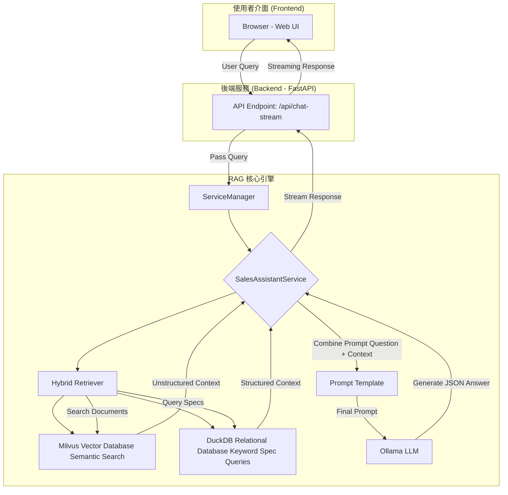

# SalesRAG: AI 智慧筆記型電腦銷售助理

專為筆記型電腦銷售業務設計的 RAG (Retrieval-Augmented Generation) 應用程式。本工具旨在賦能銷售團隊，讓他們能夠即時、準確地回應客戶對各型號筆電的規格疑問、進行深度比較，並根據客戶需求提供專業的銷售建議。

*(這是一個範例截圖，您可以替換成您應用程式的實際畫面)*

## ✨ 核心功能

  * **⚡ 即時問答**：針對客戶提出的任何關於產品規格、功能或差異的問題，提供即時且精準的回答。
  * **⚖️ 智慧比較**：不再需要手動翻閱規格表。系統能自動抓取多個型號的資料，並以清晰的表格進行並排比較。
  * **🧠 混合式搜尋**：結合**關鍵字搜尋 (DuckDB)** 與**語意搜尋 (Milvus)**，無論是精確的型號查詢還是模糊的功能描述，系統都能理解並找到最相關的資訊。
  * **📊 資料驅動的建議**：利用大型語言模型 (LLM) 的強大推理能力，不僅呈現資料，更能根據比較結果生成專業的結論與購買建議。
  * **🔌 易於擴充**：只需將新的產品規格文件（如 `.txt`, `.md`）放入 `data` 資料夾，即可輕鬆擴充知識庫，無需修改程式碼。
  * **🖥️ 友善的使用者介面**：提供簡潔直觀的網頁聊天介面，讓銷售人員可以專注於與客戶的互動。

## 🚀 系統架構

本專案採用了先進的 RAG 架構，結合了結構化與非結構化資料庫的優點，以提供最全面的回答。



## 🛠️ 技術棧

| 類別 | 技術 | 說明 |
| :--- | :--- | :--- |
| **後端框架** | [FastAPI](https://fastapi.tiangolo.com/) | 高效能的 Python Web 框架，用於建立 API。 |
| **前端** | HTML, CSS, JavaScript | 標準的網頁技術，提供使用者互動介面。 |
| **大型語言模型** | [Ollama](https://ollama.com/) | 在本地端運行大型語言模型 (如 `deepseek-r1:7b`)。 |
| **向量資料庫** | [Milvus](https://milvus.io/) | 用於儲存文字嵌入向量並進行高效的語意搜尋。 |
| **結構化資料庫** | [DuckDB](https://duckdb.org/) | 一個快速的內嵌式分析資料庫，用於儲存和查詢產品規格。 |
| **AI / 機器學習** | [LangChain](https://www.langchain.com/) | 串連 RAG 流程中各個元件的框架。 |
| | [Sentence-Transformers](https://www.sbert.net/) | 用於將文本轉換為高品質的嵌入向量。 |
| **容器化** | Docker / Docker Compose | 用於輕鬆部署 Milvus 等相依服務。 |

## ⚙️ 開始使用

請依照以下步驟在您的本地端環境中啟動專案。

### 1\. 環境準備

請確保您的電腦已安裝以下軟體：

  * Git
  * Python 3.9+
  * Docker 和 Docker Compose

### 2\. 下載專案

```bash
git clone <your-repository-url>
cd SalesRAG
```

### 3\. 安裝 Python 套件

```bash
pip install -r requirements.txt
```

### 4\. 啟動後端服務 (Milvus)

在專案根目錄下，使用 Docker Compose 啟動 Milvus 向量資料庫。

```bash
docker-compose up -d
```

初次啟動會需要一些時間下載映像檔。

### 5\. 導入資料

執行資料導入腳本，此步驟會讀取 `data/` 目錄下的文件，並將其處理後存入 DuckDB 和 Milvus。

```bash
python ingest_data.py
```

您應該會看到類似以下的輸出：

```
--- 正在處理結構化規格資料並存入 DuckDB ---
成功將 216 筆規格資料存入 DuckDB。

--- 正在處理文本資料並存入 Milvus ---
共讀取並分割成 26 個文本區塊。
...
成功將 26 筆資料導入 Milvus Collection 'sales_notebook_specs'。
```

### 6\. 啟動應用程式

```bash
uvicorn sales_rag_app.main:app --reload --host 0.0.0.0 --port 8000
```

### 7\. 開啟網頁

在您的瀏覽器中開啟 `http://127.0.0.1:8000`，即可開始與您的 AI 銷售助理互動。

## 📂 專案結構

```
SalesRAG/
├── data/
│   ├── AG958.txt                 # 產品規格原始檔
│   └── AKK839.txt                # 產品規格原始檔
│
├── sales_rag_app/
│   ├── db/
│   │   └── sales_specs.db        # DuckDB 資料庫檔案 (自動生成)
│   ├── libs/
│   │   ├── RAG/
│   │   │   ├── DB/
│   │   │   │   ├── DatabaseQuery.py
│   │   │   │   ├── DuckDBQuery.py    # DuckDB 查詢邏輯
│   │   │   │   └── MilvusQuery.py    # Milvus 查詢邏輯
│   │   │   └── LLM/
│   │   │       └── LLMInitializer.py # LLM 初始化
│   │   ├── services/
│   │   │   ├── base_service.py
│   │   │   └── sales_assistant/
│   │   │       ├── service.py        # 主要 RAG 服務邏輯
│   │   │       └── prompts/
│   │   │           └── sales_prompt.txt # LLM 提示詞模板
│   │   └── service_manager.py      # 服務管理器
│   ├── static/
│   │   ├── css/style.css
│   │   └── js/ai-chat.js
│   ├── templates/
│   │   └── index.html
│   └── main.py                     # FastAPI 應用主程式
│
├── docker-compose.yml              # Docker 服務設定 (Milvus)
├── ingest_data.py                  # 資料導入腳本
├── README.md                       # 專案說明文件
└── requirements.txt                # Python 套件依賴
```

## 🔮 未來展望

  * **支援更多文件格式**：增加對 PDF、DOCX 等常見規格書格式的解析能力。
  * **整合外部資料**：定時爬取網路上的競品資訊、價格或評測，豐富知識庫的廣度。
  * **使用者認證與對話紀錄**：為不同的銷售人員建立獨立帳號，並保存其個人對話紀錄。
  * **進階銷售洞察**：分析客戶問題趨勢，提供熱門功能或潛在銷售機會的洞察報告。
  * **多模態支援**：允許上傳產品圖片，讓 AI 能夠辨識並回答關於外觀或連接埠位置的問題。

## 📄 授權

本專案採用 [MIT License](https://www.google.com/search?q=LICENSE) 授權。
